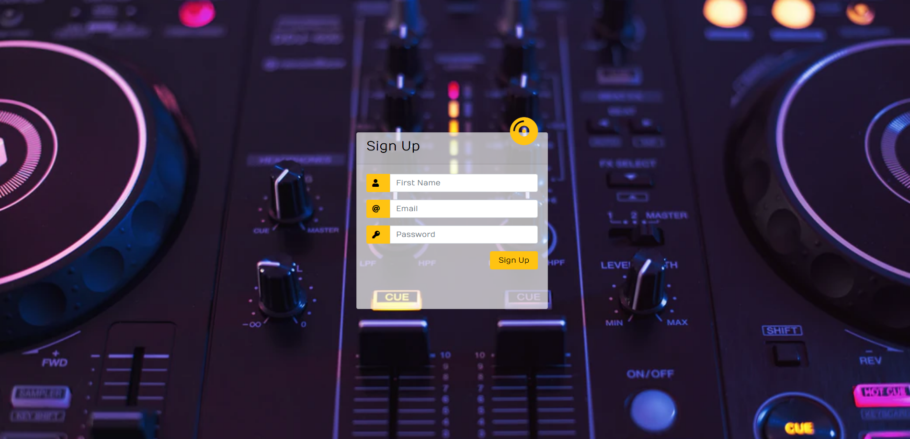
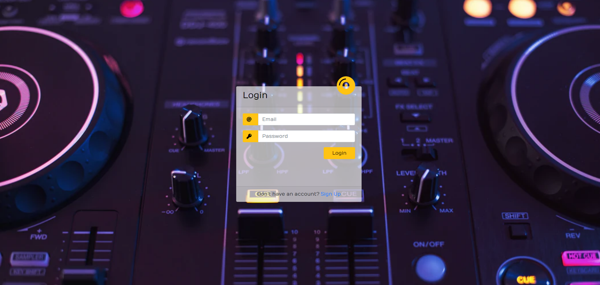
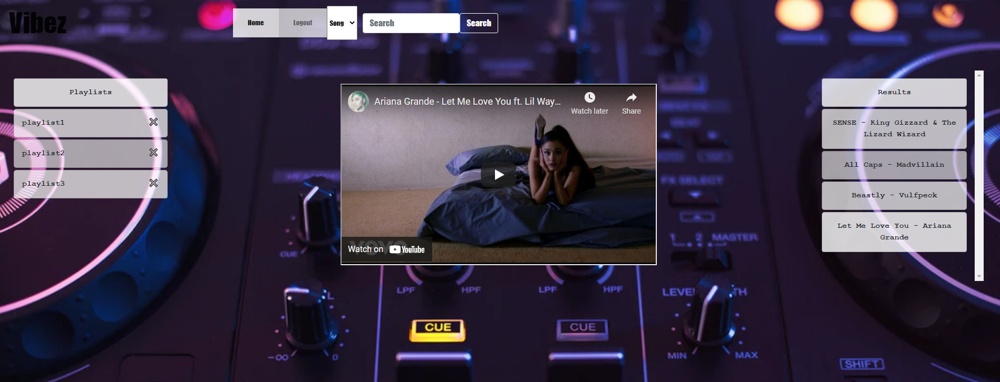
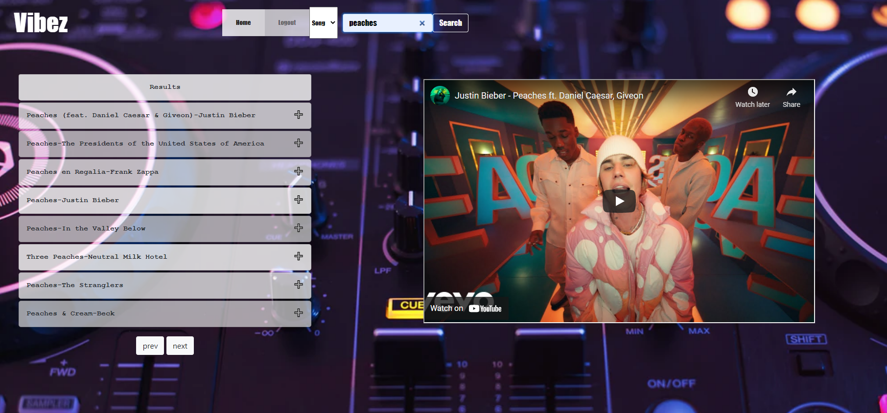
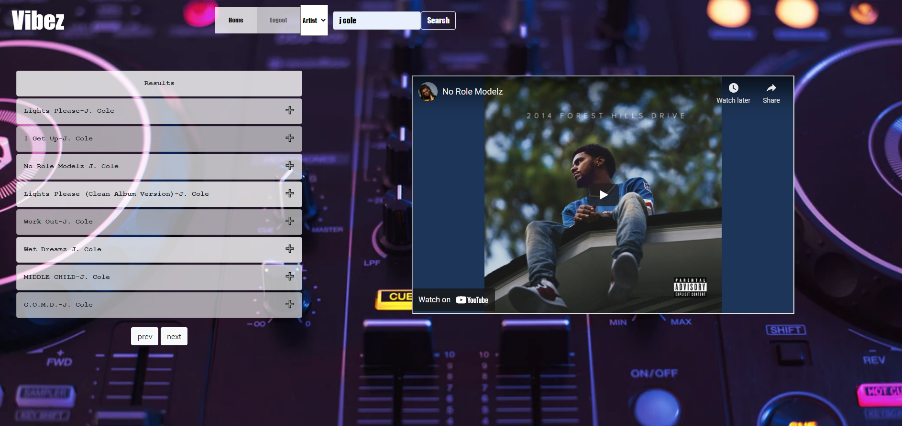
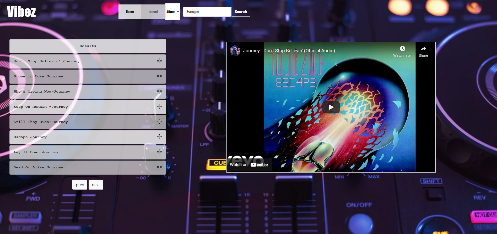

# 🔥Vibez 📻🎶🔥 

## **Project Summary** ⚡️

_Explore music with our website. Create a personal account that allows you to create as many playlists with as many songs
you would like. Customize each playlist to your wants and vibe to the music._

__________________________________________________________________________________________________________________________________________________

## **Website** 📸

___________________________________________________________________________________________________________________________________________________

## **Tools Used** 🛠️

* MYSQL
* npm
* Sequelize
* dotenv
* bcrypt
* node.js
* express.js
* Workbench
* Heroku
* youtube music api

___________________________________________________________________________________________________________________________________________________

## **Instructions**📋

* Clone repo to your local computer.
* npm i to install all proper packages in command.
* create database with workbench.
* npm start in command to run server.
* use heroku to deploy website.

___________________________________________________________________________________________________________________________________________________

## **Repo Link** 📎💡
[Github Repo](https://github.com/dmcaulay97/Vibez)

## **Contributors** 🧑‍💻

[Dylan M: Github](https://github.com/dmcaulay97)

[Greg D: Github](https://github.com/greggd1991)

[Tchaiwanda C: Github](https://github.com/TMC-glitch)

[Katherine Y : Github](https://github.com/katherineyoguez/vibez)

____________________________________________________________________________________________________________________
